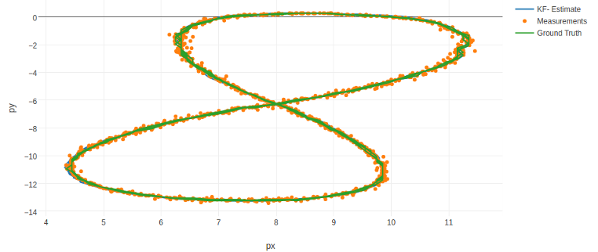

# Extended Kalman Filter Project
## Self-Driving Car Engineer Nanodegree Program

Implementation of an Extended Kalman Filter to fuse radar and lidar sensor inputs for object tracking. The goal was to beat a certain RMSE threshold set by Udacity.

This is part of a short series of projects exploring different Kalman filtering methods. The other is:
* [Unscented Kalman Filter](https://github.com/merbar/CarND-Unscented-Kalman-Filter-Project)

Plot of final result. Blue KF estimate is mostly covered up by ground truth... it does peek out a little in the lower left corner:

**See my [Unscented Kalman Filter repo](https://github.com/merbar/CarND-Unscented-Kalman-Filter-Project) for a more detailed discussion of my implementation of a sensor fusion algorithm.**

---

## Dependencies

* cmake >= 3.5
 * All OSes: [click here for installation instructions](https://cmake.org/install/)
* make >= 4.1
  * Linux: make is installed by default on most Linux distros
  * Mac: [install Xcode command line tools to get make](https://developer.apple.com/xcode/features/)
  * Windows: [Click here for installation instructions](http://gnuwin32.sourceforge.net/packages/make.htm)
* gcc/g++ >= 5.4
  * Linux: gcc / g++ is installed by default on most Linux distros
  * Mac: same deal as make - [install Xcode command line tools]((https://developer.apple.com/xcode/features/)
  * Windows: recommend using [MinGW](http://www.mingw.org/)

## Basic Build Instructions

1. Clone this repo.
2. Make a build directory: `mkdir build && cd build`
3. Compile: `cmake .. && make` 
   * On windows, you may need to run: `cmake .. -G "Unix Makefiles" && make`
4. Run it: `./ExtendedKF path/to/input.txt path/to/output.txt`. You can find
   some sample inputs in 'data/'.
    - eg. `./ExtendedKF ../data/sample-laser-radar-measurement-data-1.txt output.txt`
